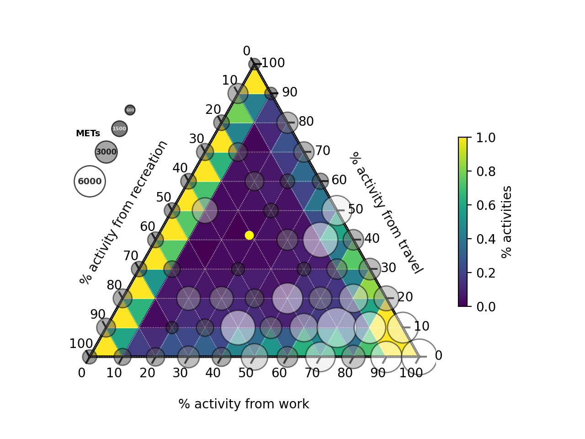

# Domain composition of physical activity

This program generates a ternary plot of METs (Metabolic Equivalent of Task) values for three activity categories: `work`, `travel`, and `recreation`. The input data must be in a `data_XXX.csv` format (where XXX is any 3-letter code) and should have the following structure:

## Input Data Format

The input data should be a CSV file with the following columns:

1. `ID`: Respondent ID
2. `PtotalMETs`: Total METs
3. `percentage_work`: Percentage of METs related to work (in %)
4. `percentage_travel`: Percentage of METs related to travel (in %)
5. `percentage_recreation`: Percentage of METs related to recreation (in %)
6. `weight`: Weight balance coefficient (0-1) for weighting each sample (optional)

## Input Data Format Example

Below is an example of the data format required for the input CSV file (`data_XXX.csv`):

| ID    | PtotalMETs | percentage_work | percentage_travel | percentage_recreation | weight   |
|-------|------------|-----------------|-------------------|-----------------------|----------|
| 1 | 480.00     | 0.00            | 0.00              | 100.00                | 3644.23  |
| 2 | 1140.00    | 0.00            | 78.95             | 21.05                 | 5731.78  |
| 3 | 600.00     | 0.00            | 0.00              | 100.00                | 9216.62 |

## Command Line Options

The program accepts the following command line options:

- `--country` (Required): The 3-letter code used in the input file name (data_XXX.csv)
- `--filter` (Optional): Apply a Gaussian filter to the data
- `--mets` (Optional): Display the average METs of the data points in each histogram bin as circles
- `--average` (Optional): Display the overall average value on the ternary plot

## Usage

1. Prepare your input data file in the `data_XXX.csv` format, where XXX is a 3-letter country code.
2. Run the program with the appropriate command line options, e.g.:

```
python ternary_mets_plot.py --country XXX --filter --mets --average
```

3. The program will generate a ternary plot of the METs values for the specified country, with optional filtering, average METs circles, and the overall average value displayed.

## Sample Output

The generated ternary plot will look like the following example:



This sample image shows the distribution of METs for work, travel, and recreation activities on a ternary plot.

## Dependencies

This project requires the following libraries:

- python-ternary==1.0.8
- numpy==1.24.3
- pandas==2.0.1
- matplotlib==3.7.1
- seaborn==0.12.2
- scipy==1.10.1
- argparse==1.1

Please make sure to install the required dependencies before running the program. You can do this by running:

```
pip install -r requirements.txt
```

## Contact

For any questions or inquiries, please contact:

Narumi Fujioka
- Associate Professor, Faculty of Law, Hosei University
- Special Researcher, Sasakawa Sports Foundation

Yuki Hayashi
- Lecturer, Department of Sociology, Otemon Gakuin University

## License

This project is licensed under the MIT License. See the [LICENSE](LICENSE) file for details.
